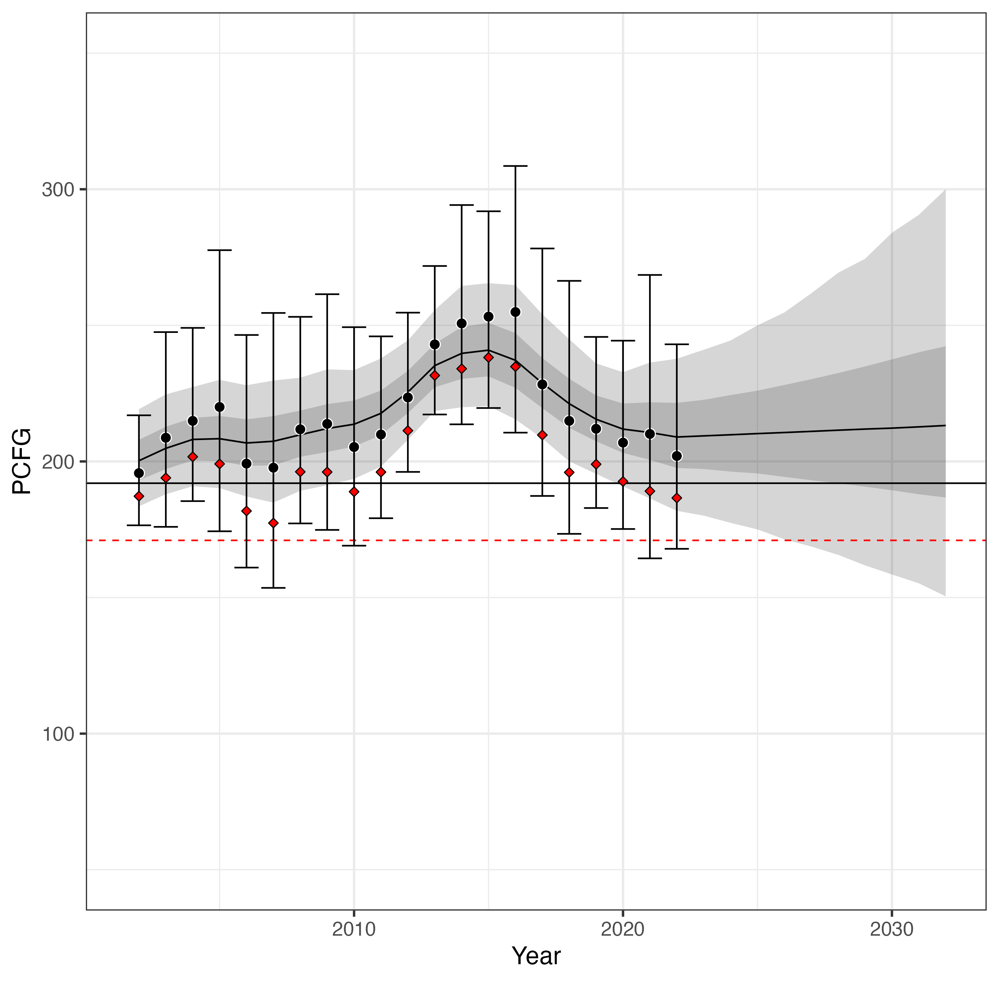

# PCFG: Strawdog State Space Model
This code can be run with R and cmdstan (to compile and run the Stan code). The R working directory is assumed to be that where this README file resides(e.g., if you use RStudio, put your *.RProj file in that same top directory, or use the `setwd()` command in R, etc.). The R control script is "./R/pcfg_lognorm.R".

The state space model code is in "./STAN/pcfg_lognorm.stan". Note that code also stores the point-wise log-likelihood, which would allow other models (e.g., with auto-correlated process error) to be compared statistically, in terms of predictive accuracy, through leave-one-out (LOO) cross-validation. 

Preliminary model fits, and projections are shown in the figure below. In this figure, the N_MIN values (20th percentile of log-normal abundance estimates) are plotted as red triangles. The red-dashed horizontal line denotes the minimimum abundance threshold of 171, and the solid black horizontal line the abundance threshold of 192. The solid curved black line shows the mean of the posterior for modeled abundance, the dark gray ribbon shows the 20th and 80th percentiles of the posterior and the light gray ribbon represents the 95th credible intervals. This figures shows an example of a projection of abundance 10yrs into the future.
  

## Update: 10/19/2024
The following depicts projections from various updated model variants. All now include harvest with abundance projected out three years (2025), though for sake of simplicity and model transparency harvest has been set to 0.

### Original model with harvest
Original model with harvest (set to 0) and projected three years out for comparison.

### Original model with logLambda and harvest
Previous model assumed lambda was normal, but it is not. This version (and only this model currently) uses logLambda (r) instead.

### AR1 model version 1
Uses lambda as in the original model, but now models consecutive lambdas as a function of the previous year's lambda.

### AR1 model version 2
Uses lambda as in the original model. A more traditional, regression based AR1 model.  Not ideal, but figured it was worth seeing the differences.

### Lambda as a function of calf numbers
Models lambda as a function of calf numbers (no time lag). Present figure is depicted an assumed 2 calves per year for three years without abundance estimates.
